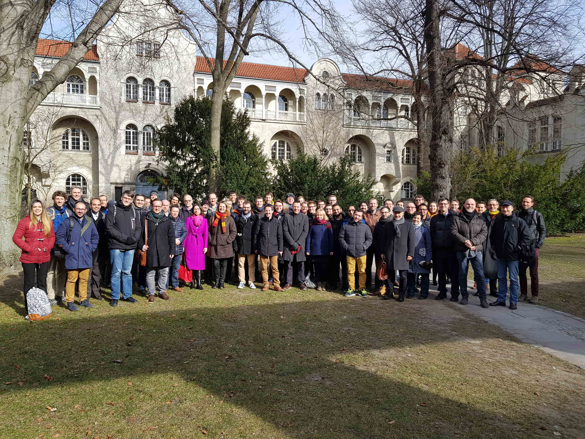

# IBPSA Project 1 Expert Meeting in Berlin

**DRAFT**

On February 27 and 28, 2018, the IBPSA Project 1 held its first Expert Meeting at the UdK Berlin, hosted by Christoph Nytsch-Geusen.
The meeting was attended by 60 people. The main focus of meeting was to organize the work
within and the dependencies among the work packages. There was also a
well received keynote by Hubertus Tummescheit,
Chief Strategy Officer and co-founder of Modelon,
about "The Adoption of MPC in the Power Industry – Lessons Learned and Ideas for the Buildings Industry".

{:width="250px"}

During the meeting, the following work was prioritized for the work packages.
While detailed plans may change during the 5 year project duration,
the listing gives an overview about the main priorities.

## WP 1.1: Modelica Library for Design and Operation

The focus will be to develop a validated, well-documented Modelica library
for the design and operation of building and district energy systems. This will be
accomplished by further developing https://github.com/ibpsa/modelica-ibpsa, expanding
its scope and documentation, and restructuring the library for easier use by non-expert.

The goal is to create a library that will serve as the basis of user-focused distributions
of Modelica libraries for the building energy domain, in particular the libraries
AixLib (RWTH Aachen), Buildings (LBNL), BuildingSystems (UdK Berlin) and IDEAS (KU Leuven)
that use the IBPSA library as their core. Furthermore, a goal is that such libraries
will be included in building energy simulation programs, including but not limited to EnergyPlus.

## WP 1.2: Model Predictive Control

The focus of WP 1.2 is threefold. 
The first objective is to develop a Modelica library, possibly as a package of the IBPSA Modelica library, with models that can be used to efficiently solve optimal control problems for building and district energy systems within a Model Predictive Control (MPC) algorithm, and that can be combined with parameter and state estimation algorithms to adapt the models using measured data.The outcome will be an open-source, free Modelica library of component and system models for optimization, hosted on https://github.com/ibpsa.
The second objective is to develop a common framework to test and assess MPC performance. This framework is a virtual test bed that represents a common architecture with detailed building emulator models that allow control by MPC. Both the more European hydronic systems and the more American air-based systems are represented for different building types and complexities. The outcome will be an open source Building Optimization Test (BOP-TEST) hosted on https://github.com/ibpsa.
The third objective is to compare and benchmark different MPC formulations using the BOP-TEST and selected performance indicators. the outcome will be a set of well-documented and tested MPC algorithms with their corresponding performances as benchmarked, and guidelines for good practice in MPC design.

## WP 2.1 City District Information Modeling

The focus here is on improving the efficiency and reducing the uncertainty of urban energy simulation workflows. Key subtasks include: (i) international data mapping: defining the task-dependent data needs of urban energy simulation software, the existence and - for this is often different - availability of data, and strategies to plug the gaps between what is needed and what is available; (ii) international archetype mapping: defining country-specific domestic and non-domestic building archetypes and associated age bands, to support the semantic attribution of 3D models for urban energy simulation. Likewise, the development of classification techniques to automate the assignment of archetypes and age bands using geospatial data; (iii) parsimonious geometric processing: better understanding the appropriate level of geometric complexity needed for urban energy simulation purposes, and developing and deploying strategies to reduce geometric model complexity to these apporpriate levels; (iv) parsimonious semantic enrichment: (semi-)autmated workflows for the acquisition, sanitation and assignment of attributes to 3D models; (v) data exchange, using CityGML and its related application domain extensions (ADEs); (vi) demonstration of the capabilities of urban energy simulation software. 

## WP 2.2 Building Information Modeling

Starting from the observation that geometry processing between BIM and BPS is a tedious and error-prone process lacking a robust method for space boundary and zone identification, this work package strives to develop advanced space boundary algorithms for BIM model topology analysis and multi-scale simulation model generation. As well, the focus is on continuing the developments of the modular BIM to BPS transformation toolchain from the IEA Annex 60 for the HVAC domain. Likewise, and as a precondition, the developments will include joint work and coordination of a common BIM/HVAC classification scheme, well-linked to international standardization issues as well as the continuation of the IDM and MVD developments of the IEA Annex 60.

## WP 3.1 Application

Dirk

## WP 3.2 District energy DESTEST

Dirk

The next meeting will be in fall in Paris, organized by Lisa Rivalin and Valentin Gavan of Engie.

For more information about the project, visit https://ibpsa.github.io/project1/index.html
