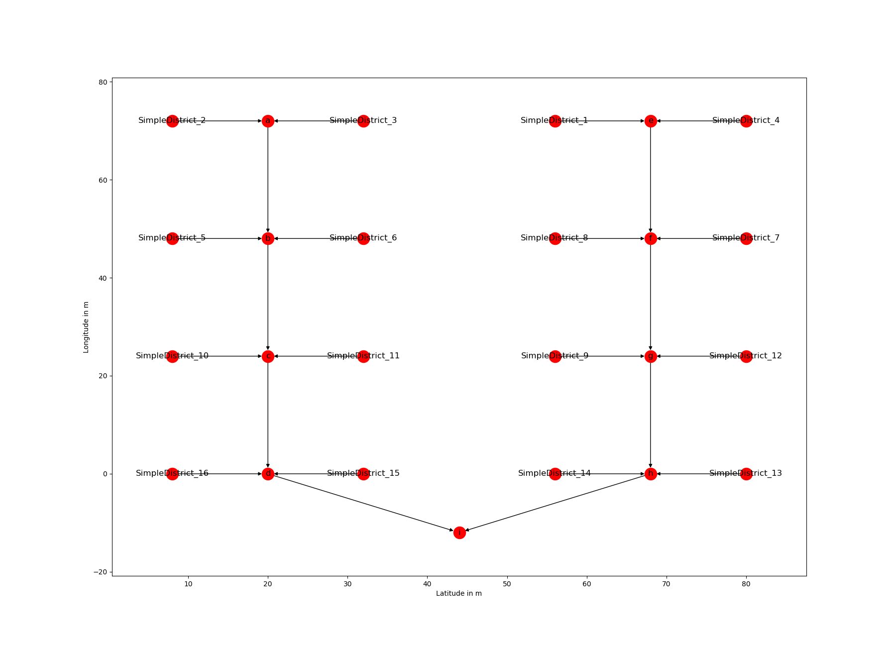

# Network modelling

_COMMON EXERCISE 1_

## Neighborhood

Building identifiers and network layout can be seen in image above.

## Network
Radial network with two main branches that supplies two streets with 8 buildings each.

### Design
- Dimensions based on peak load/desired pressure for the longest path in the network.
- Refer to folder ``wp_3_2_destest/Network/NetworkSizing/`` for calculation of pipe diameters. Current parameters in ``Pipe data.csv`` in said folder.

### Assumptions
- Supply temperature 50°C
- Return temperature determined by consumers
- Pipes buried underground (buried depth unspecified)
- Constant ground temperature 12°C, directly outside of insulation of pipes
- Ideal heat supply system (controls supply temperature in network)
- Pressure drops are currently not included.

## Consumer model
Simple consumer with deterministic heat load; each customer has a decentralized pump that pulls the desired mass flow from the network.
Heat load profile for each of the buildings can be found in ``wp_3_2_destest/Results/SimpleDistrict/SimpleDistrict_district.csv``.

### Assumptions
- Fixed temperature drop of 20K over substation
- Mass flow rate determined by heat load and fixed temperature drop
- Minimal mass flow rate to avoid problems with undercooling of heat exchange fluid (bypass flow)
- Ideal control (instantaneous) and emission of heat (temperature-independent)

## Results to compare
- Heat injection
- Heat losses
- (Pumping power)
- (Total water mass passing through the heat generation)
- (Network temperatures)
- (Substation performance)

(between parentheses: will be compared in a later step)

### Format
- Time step: 15 min
- Horizon: One year
- File format: .csv
- Columns: Time / Central heat injection / Total network heat loss
